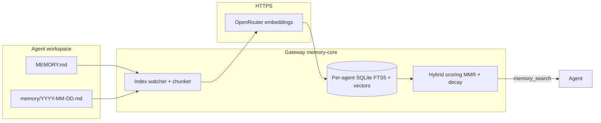

# Memory (wrapper defaults)

Semantic memory: workspace files, builtin SQLite index, `memory-core`, env vars, deployment. Upstream docs:

- [Memory overview](https://docs.openclaw.ai/concepts/memory)
- [Builtin memory engine](https://docs.openclaw.ai/concepts/memory-builtin)
- [Memory search](https://docs.openclaw.ai/concepts/memory-search)
- [Memory configuration reference](https://docs.openclaw.ai/reference/memory-config) — full knob list for `memorySearch`, QMD, citations, etc.
- [Dreaming (experimental) — config keys](https://docs.openclaw.ai/reference/memory-config#dreaming-experimental) — canonical location for `plugins.entries.memory-core.config.dreaming` (phases, schedules, `execution`, `storage`, …)
- [Dreaming (experimental) — concepts & commands](https://docs.openclaw.ai/concepts/dreaming)
- [`openclaw memory` CLI](https://docs.openclaw.ai/cli/memory)

---

## 1. Defaults

| Item | Setting |
|------|---------|
| Embeddings | OpenRouter, `openai/text-embedding-3-small`, `OPENROUTER_API_KEY` |
| Engine | Builtin SQLite + FTS5 + vectors (no QMD in template) |
| `memorySearch.fallback` | `none` |
| Workspace | `MEMORY.md` + `memory/YYYY-MM-DD.md` |
| Dreaming | `plugins.entries.memory-core.config.dreaming`; keys in [memory-config → Dreaming](https://docs.openclaw.ai/reference/memory-config#dreaming-experimental), behavior in [concepts/dreaming](https://docs.openclaw.ai/concepts/dreaming) |

---

## 2. Three layers

### Layer A — Workspace files

- **`MEMORY.md`**: loaded at session start (upstream behavior).
- **`memory/YYYY-MM-DD.md`**: daily notes; compaction targets.
- Optional: more under `memory/` or `memorySearch.extraPaths` (unset in template).

### Layer B — Builtin memory index (SQLite)

OpenClaw indexes `MEMORY.md` and `memory/**/*.md` into **chunks** (defaults per upstream). Per agent:

- **Keyword**: FTS5 (BM25).
- **Semantic**: Embeddings from the configured provider (here: OpenRouter).
- **Hybrid**: Weighted merge (template uses 0.7 vector / 0.3 text, plus MMR and temporal decay).

**Index path** (set explicitly in the template):

`~/.openclaw/memory/{agentId}.sqlite`

In Docker, `~/.openclaw` is mounted from host **`OPENCLAW_CONFIG_DIR`**.

### Layer C — Tools and automation

- **`memory_search`** / **`memory_get`** — [Memory tools](https://docs.openclaw.ai/concepts/memory).
- **`memory-core`** — Indexing, `openclaw memory …` CLI, and **Dreaming**.
- **`session-memory` hook** — Enabled in the template (`hooks.internal.entries`).

---

## 3. Builtin engine vs QMD

**QMD** is an alternate `memory.backend` using a **`qmd`** executable for local-first search and reranking.

This wrapper’s templates use the **builtin** SQLite engine (no `memory.backend: "qmd"`). To use QMD instead, set `memory.backend` to `"qmd"` and add `memory.qmd` per [QMD engine](https://docs.openclaw.ai/concepts/memory-qmd).

---

## 4. Configuration in this repo

| File | Role |
|------|------|
| `config/openclaw.json` | Docker (`openclaw-secure/scripts/setup.sh` on first deploy) |
| `config/openclaw.native.json` | Native (`openclaw-raw/scripts/setup.sh`) |

### 4.1 Top-level `memory`

```json
"memory": {
  "citations": "auto"
}
```

- **`citations`**: Search snippets may include a `Source:` footer; `auto` is the default ([memory-config](https://docs.openclaw.ai/reference/memory-config), Citations / `memory.citations`).
- **`backend` omitted** → builtin SQLite engine ([builtin engine](https://docs.openclaw.ai/concepts/memory-builtin)).

### 4.2 `agents.defaults.memorySearch`

Controls embeddings, store path, hybrid ranking, cache, and optional session indexing.

| Key | Role |
|-----|------|
| `provider` / `model` | `"openai"` with `openai/text-embedding-3-small` via OpenRouter. |
| `remote.baseUrl` | `https://openrouter.ai/api/v1` |
| `remote.apiKey` | `${OPENROUTER_API_KEY}` |
| `fallback` | `"none"` |
| `store.path` | `~/.openclaw/memory/{agentId}.sqlite` |
| `query.hybrid` | Vector + BM25, MMR, temporal decay. |
| `cache` | Embedding cache for unchanged chunks. |
| `experimental.sessionMemory` + `sources` | Session transcripts in search (experimental; see upstream). |

Changing **provider**, **model**, or chunking can require a **full reindex** ([memory-config](https://docs.openclaw.ai/reference/memory-config)).

### 4.3 `plugins.entries["memory-core"]`

Per [Memory configuration reference → Dreaming (experimental)](https://docs.openclaw.ai/reference/memory-config#dreaming-experimental), Dreaming is **not** under `agents.defaults.memorySearch`; it lives only under `plugins.entries.memory-core.config.dreaming`. The templates use the same minimal shape as the [Dreaming quick start](https://docs.openclaw.ai/concepts/dreaming) (master switch on; light / deep / REM use their documented defaults until you add `phases` or other keys from the reference):

```json
"memory-core": {
  "enabled": true,
  "config": {
    "dreaming": {
      "enabled": true
    }
  }
}
```

**Docker (`openclaw-secure`):** `setup.sh` / `upgrade.sh` run `patch-openclaw-source.sh` before the image build. That patch adds `dreaming` to bundled `memory-core`’s `configSchema` when upstream still ships an empty `properties` object with `additionalProperties: false` (which incorrectly rejects the official JSON). Rebuild the image after pulling wrapper changes so validation matches the docs.

**Native (`openclaw-raw`):** If your globally installed `openclaw` is a stock npm build without that patch, you may still see `plugins.entries.memory-core.config: invalid config: must NOT have additional properties` until upstream updates the plugin schema or you run a gateway built from patched OpenClaw source. Chat commands from the same doc (`/dreaming on`, etc.) remain available when the feature is present.

Tune **`timezone`**, **`verboseLogging`**, **`storage`**, **`phases.light` / `deep` / `rem`**, **`execution`**, and **`execution.defaults`** using the tables in [memory-config → Dreaming (experimental)](https://docs.openclaw.ai/reference/memory-config#dreaming-experimental).

`openclaw memory` requires matching CLI and gateway builds; otherwise use the **`memory_search`** tool or rebuild the image.

### 4.4 Related settings

- **`agents.defaults.compaction.memoryFlush`**
- **`hooks.internal.entries["session-memory"]`**

### 4.5 Validation vs [memory-config](https://docs.openclaw.ai/reference/memory-config)

This wrapper’s `config/openclaw.json` and `config/openclaw.native.json` are aligned with the reference as follows (spot-check after edits):

| Reference area | Template alignment |
|----------------|-------------------|
| Top-level `memory` | `citations: "auto"`; no `memory.backend` → **builtin** SQLite engine (not QMD). |
| `agents.defaults.memorySearch` | `provider` / `model` / `fallback`; `remote.baseUrl` + `remote.apiKey` (OpenAI-compatible OpenRouter); `store.path` with `{agentId}`; `query.hybrid` (weights, MMR, temporal decay); `cache.enabled` + `maxEntries`; experimental session indexing (`experimental.sessionMemory`, `sources`, `sync.sessions`). |
| Dreaming | `plugins.entries.memory-core.config.dreaming.enabled: true` only; optional fields (`phases`, `timezone`, `storage`, …) per [Dreaming (experimental)](https://docs.openclaw.ai/reference/memory-config#dreaming-experimental). |

**Note:** The reference defaults `cache.enabled` to `false`; this template sets **`true`** to avoid re-embedding unchanged chunks ([Embedding cache](https://docs.openclaw.ai/reference/memory-config#embedding-cache)).

## 5. Environment variables

| Variable | Purpose |
|----------|---------|
| `OPENROUTER_API_KEY` | Chat and embeddings (`memorySearch.remote.apiKey`). |
| `TAVILY_API_KEY` | Tavily plugin (not embeddings). |
| `OPENCLAW_CONFIG_DIR` | Host config; `openclaw.json` and `memory/*.sqlite` in-container under `~/.openclaw`. |
| `OPENCLAW_WORKSPACES_DIR` | Agent workspaces (`MEMORY.md`, `memory/`). |

## 6. Deploying config changes

- Docker: `setup.sh` copies `config/openclaw.json` only when `openclaw.json` is absent; otherwise merge manually and restart the gateway.
- Native: `openclaw-raw/scripts/setup.sh`; `--sync-config` in [INSTALL-native.md](../openclaw-raw/docs/INSTALL-native.md).

Install: [INSTALL-docker.md](../openclaw-secure/docs/INSTALL-docker.md), [INSTALL-native.md](../openclaw-raw/docs/INSTALL-native.md). Reindex after changing embedding provider or model (§8).

---

## 7. Data flow



## 8. Verification

```bash
./openclaw-secure/scripts/cli.sh memory status --deep
./openclaw-secure/scripts/cli.sh memory status --deep --agent mv-coder
./openclaw-secure/scripts/cli.sh memory search "your phrase" --agent mv-researcher
```

`docker compose` (match local overlays; see `openclaw-secure/scripts/_common.sh`):

```bash
cd openclaw-secure
docker compose -f docker-compose.yml -f docker-compose.secure.yml \
  -f docker-compose.ports.localhost.yml -f docker-compose.skills.yml \
  run --rm openclaw-cli memory status --deep
```

| Command | Use |
|---------|-----|
| `memory status --deep` | Provider resolution, index health. |
| `memory status --agent <id>` | Same, scoped to one agent. |
| `memory index --force` | Full rebuild after provider/model change. |
| `memory search "phrase"` | End-to-end retrieval test. |
| `memory search … --min-score 0` | Weak hybrid matches (short queries). |
| `memory search --agent <id> …` | Scoped search. |
| `memory promote --limit 10` | Dreaming preview (`--apply` writes `MEMORY.md`). |

## 9. Multi-agent isolation

Per-agent index: `~/.openclaw/memory/{agentId}.sqlite` on the host under **`OPENCLAW_CONFIG_DIR/memory/`**. Hybrid scoring can filter very short queries; use longer phrases or `--min-score 0`.

Example (repo root, `.env` loaded):

```bash
set -a && source .env && set +a
TODAY=$(date +%F)
mkdir -p "$OPENCLAW_WORKSPACES_DIR/mv-coder/memory" "$OPENCLAW_WORKSPACES_DIR/mv-researcher/memory"

printf '%s\n' 'MV memory isolation (coder workspace only): QUAILMVCDR7p9k' \
  >>"$OPENCLAW_WORKSPACES_DIR/mv-coder/memory/${TODAY}.md"
printf '%s\n' 'MV memory isolation (researcher workspace only): VELVETMVRSR4m2n' \
  >>"$OPENCLAW_WORKSPACES_DIR/mv-researcher/memory/${TODAY}.md"

./openclaw-secure/scripts/cli.sh memory index --force --agent mv-coder
./openclaw-secure/scripts/cli.sh memory index --force --agent mv-researcher
./openclaw-secure/scripts/cli.sh memory search QUAILMVCDR7p9k --agent mv-coder
./openclaw-secure/scripts/cli.sh memory search VELVETMVRSR4m2n --agent mv-researcher
./openclaw-secure/scripts/cli.sh memory search VELVETMVRSR4m2n --agent mv-coder
./openclaw-secure/scripts/cli.sh memory search QUAILMVCDR7p9k --agent mv-researcher
```

Cross-agent searches should not return the other agent’s line. With `memorySearch.sources` including `sessions`, session text can blur isolation; use file-backed hits or fresh agents to validate.

---

## 10. Troubleshooting

| Symptom | Check |
|---------|--------|
| `unknown command 'memory'` | Version skew; use `memory_search` or rebuild image. |
| Wrong provider in `memory status` | `OPENROUTER_API_KEY`, `remote.baseUrl`, `model`, HTTPS egress. |
| Empty search | Workspace `memory/` files; `memory index --force --agent <id>`; longer query or `--min-score 0`. |
| CLI / gateway errors | Align image and CLI versions. |
| Unexpected `MEMORY.md` edits | Dreaming; `/dreaming off` or adjust config. |
| `memory-core.config` / `additional properties` | Docker: rebuild after `upgrade.sh` (schema patch). Native: stock CLI may lack schema fix (§4.3). |
| High embedding usage | `experimental.sessionMemory` / `sync.sessions`. |

Keep in sync with `config/openclaw.json` and `config/openclaw.native.json`.
