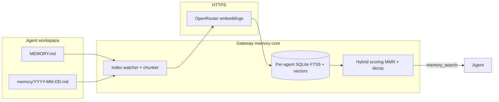

# Memory management (Messy Virgo wrapper)

How **semantic memory** is configured in this repository: workspace files, the builtin index, plugins, env vars, deployment, and verification.

Official OpenClaw references:

- [Memory overview](https://docs.openclaw.ai/concepts/memory)
- [Builtin memory engine](https://docs.openclaw.ai/concepts/memory-builtin)
- [Memory search](https://docs.openclaw.ai/concepts/memory-search)
- [Memory configuration reference](https://docs.openclaw.ai/reference/memory-config)
- [Dreaming (experimental)](https://docs.openclaw.ai/concepts/dreaming)
- [`openclaw memory` CLI](https://docs.openclaw.ai/cli/memory)

---

## 1. Design goals

| Goal | Approach |
|------|----------|
| **No local embedding models** | Embeddings over HTTPS to **OpenRouter** (`openai/text-embedding-3-small` via OpenAI-compatible API). No GGUF or GPU for vectors. |
| **Few moving parts** | **Builtin** engine only (per-agent SQLite + FTS5 + vectors). No QMD binary in the default stack. |
| **Predictable cost** | Chat and embeddings share **`OPENROUTER_API_KEY`**. `memorySearch.fallback` is `none` (no silent failover to another embedding provider). |
| **Durable vs scratch notes** | Daily logs under `memory/YYYY-MM-DD.md`, long-term curation in workspace **`MEMORY.md`**. Compaction prompts flush durable notes to disk. |
| **Optional consolidation** | **Dreaming** (`memory-core`) can promote high-signal snippets into `MEMORY.md` on a schedule when enabled. |

---

## 2. Three layers

### Layer A — Workspace files (source of truth for prose)

- **`MEMORY.md`** — Curated, long-lived context (loaded at session start per upstream behavior).
- **`memory/YYYY-MM-DD.md`** — Daily notes; typical target for compaction “flush to disk.”
- Optional: more markdown under `memory/` or paths in `memorySearch.extraPaths` (not set in the default template).

Humans and agents edit these files; the index is derived from them.

### Layer B — Builtin memory index (SQLite)

OpenClaw indexes `MEMORY.md` and `memory/**/*.md` into **chunks** (defaults per upstream). Per agent:

- **Keyword**: FTS5 (BM25).
- **Semantic**: Embeddings from the configured provider (here: OpenRouter).
- **Hybrid**: Weighted merge (template uses 0.7 vector / 0.3 text, plus MMR and temporal decay).

**Index path** (set explicitly in the template):

`~/.openclaw/memory/{agentId}.sqlite`

In Docker, `~/.openclaw` is mounted from host **`OPENCLAW_CONFIG_DIR`**.

### Layer C — Tools and automation

- **`memory_search`** / **`memory_get`** — [Memory tools](https://docs.openclaw.ai/concepts/memory).
- **`memory-core`** — Indexing, `openclaw memory …` CLI, and **Dreaming**.
- **`session-memory` hook** — Enabled in the template (`hooks.internal.entries`).

---

## 3. Builtin engine vs QMD

**QMD** is an alternate `memory.backend` using a **`qmd`** executable for local-first search and reranking.

This wrapper’s templates use the **builtin** SQLite engine (no `memory.backend: "qmd"`). To use QMD instead, set `memory.backend` to `"qmd"` and add `memory.qmd` per [QMD engine](https://docs.openclaw.ai/concepts/memory-qmd).

---

## 4. Configuration in this repo

| File | Role |
|------|------|
| `config/openclaw.json` | Docker (`openclaw-secure/scripts/setup.sh` on first deploy) |
| `config/openclaw.native.json` | Native (`openclaw-raw/scripts/setup.sh`) |

### 4.1 Top-level `memory`

```json
"memory": {
  "citations": "auto"
}
```

- **`citations`**: Search snippets may include a `Source:` footer; `auto` is the default ([memory-config](https://docs.openclaw.ai/reference/memory-config)).
- **`backend` omitted** → builtin SQLite engine ([builtin engine](https://docs.openclaw.ai/concepts/memory-builtin)).

### 4.2 `agents.defaults.memorySearch`

Controls embeddings, store path, hybrid ranking, cache, and optional session indexing.

| Key | Role |
|-----|------|
| `provider` / `model` | `"openai"` with `openai/text-embedding-3-small` via OpenRouter. |
| `remote.baseUrl` | `https://openrouter.ai/api/v1` |
| `remote.apiKey` | `${OPENROUTER_API_KEY}` |
| `fallback` | `"none"` |
| `store.path` | `~/.openclaw/memory/{agentId}.sqlite` |
| `query.hybrid` | Vector + BM25, MMR, temporal decay. |
| `cache` | Embedding cache for unchanged chunks. |
| `experimental.sessionMemory` + `sources` | Session transcripts in search (experimental; see upstream). |

Changing **provider**, **model**, or chunking can require a **full reindex**.

### 4.3 `plugins.entries["memory-core"]`

```json
"memory-core": {
  "enabled": true,
  "config": {
    "dreaming": {
      "mode": "rem"
    }
  }
}
```

Uses **`rem`** with **preset thresholds only** (no overrides): per the [modes table](https://docs.openclaw.ai/concepts/dreaming#dreaming-experimental), that is roughly **every 6 hours**, `minScore` **0.85**, `minRecallCount` **4**, `minUniqueQueries` **3**, `recencyHalfLifeDays` **14**. Add optional keys (`recencyHalfLifeDays`, `maxAgeDays`, `minScore`, `cron`, etc.) only when you want to diverge from that baseline — see [Dreaming](https://docs.openclaw.ai/concepts/dreaming).

**Dreaming** (experimental): tracks recall from `memory_search` hits on daily notes and can promote into **`MEMORY.md`** on a schedule. Modes: `off`, `core`, `rem`, `deep` — see the [modes table](https://docs.openclaw.ai/concepts/dreaming#dreaming-experimental). With **`mode` not `off`**, the Control UI usually shows the **Dreams** tab. You can still use **`/dreaming`** commands in chat where supported.

**Release vs docs:** OpenClaw **v2026.4.2** ships `memory-core` without Dreaming in the extension and an empty `configSchema`, so this block can fail validation (`must NOT have additional properties`) and the Dreams UI will not appear until you build from a newer revision (e.g. **`origin/main`**) or a release that includes Dreaming. **`setup.sh`** resets the source checkout to **`main`**; **`upgrade.sh`** currently pins the **latest `v*` tag**, which can move you back to a tag without Dreaming.

The **`openclaw memory`** CLI is provided by **memory-core**; it appears only when the CLI and gateway versions match the [memory CLI](https://docs.openclaw.ai/cli/memory) docs. If `openclaw memory` is missing, use agent **`memory_search`** (below) or upgrade/rebuild the image.

### 4.4 Related settings

- **`agents.defaults.compaction.memoryFlush`** — Nudges durable notes into `memory/YYYY-MM-DD.md` before compaction.
- **`hooks.internal.entries["session-memory"]`** — Session/memory integration.

---

## 5. Environment variables

| Variable | Purpose |
|----------|---------|
| `OPENROUTER_API_KEY` | Chat and embeddings (`memorySearch.remote.apiKey`). |
| `TAVILY_API_KEY` | Tavily web search plugin (not memory vectors). |
| `OPENCLAW_CONFIG_DIR` | Host dir → `~/.openclaw` in container; holds `openclaw.json` and **`memory/*.sqlite`**. |
| `OPENCLAW_WORKSPACES_DIR` | Workspaces with `MEMORY.md` and `memory/`. |

Ensure `.env` sets `OPENROUTER_API_KEY` for the secure stack.

---

## 6. Deploying config changes

- **First Docker deploy:** `setup.sh` copies `config/openclaw.json` only if `openclaw.json` is **missing**. Otherwise merge or replace manually, then restart the gateway.
- **Native:** `openclaw-raw/scripts/setup.sh`; template refresh via **`--sync-config`** in [INSTALL-native.md](../openclaw-raw/docs/INSTALL-native.md).

Greenfield: [INSTALL-docker.md](../openclaw-secure/docs/INSTALL-docker.md) or [INSTALL-native.md](../openclaw-raw/docs/INSTALL-native.md). No mandatory `memory index --force` on first install. After changing embedding **provider** or **model**, run a forced reindex once (§8).

---

## 7. Data flow



Dreaming (not shown) may write to **`MEMORY.md`** when enabled.

---

## 8. Verification

With the gateway running and a CLI that exposes **`memory`**:

```bash
./openclaw-secure/scripts/cli.sh memory status --deep
# Per agent (when supported):
./openclaw-secure/scripts/cli.sh memory status --deep --agent mv-coder
./openclaw-secure/scripts/cli.sh memory search "your phrase" --agent mv-researcher
```

Direct `docker compose` (match your overlays; see `openclaw-secure/scripts/_common.sh`):

```bash
cd openclaw-secure
docker compose -f docker-compose.yml -f docker-compose.secure.yml \
  -f docker-compose.ports.localhost.yml -f docker-compose.skills.yml \
  run --rm openclaw-cli memory status --deep
```

| Command | Use |
|---------|-----|
| `memory status --deep` | Provider resolution, index health. |
| `memory status --agent <id>` | Same, scoped to one agent. |
| `memory index --force` | Full rebuild after provider/model change. |
| `memory search "phrase"` | End-to-end retrieval test. |
| `memory search … --min-score 0` | Include weak hybrid matches (short tokens often need this). |
| `memory search --agent <id> …` | Search one agent’s index. |
| `memory promote --limit 10` | Preview Dreaming candidates (`--apply` writes `MEMORY.md`). |

**Always works (tool path):** put a unique sentence in an agent workspace under `memory/YYYY-MM-DD.md`, then in that agent’s session ask it to run **`memory_search`** for that phrase.

---

## 9. Multi-agent testing

Each entry in `agents.list` gets its **own** workspace and **own** SQLite file:

`~/.openclaw/memory/{agentId}.sqlite` → on the host, under **`OPENCLAW_CONFIG_DIR/memory/`** (e.g. `main.sqlite`, `mv-coder.sqlite`, `mv-researcher.sqlite`, `mv-planner.sqlite`).

Hybrid search uses a **score floor**; tiny tokens (e.g. `plugh`) often score below the default cutoff even when indexed. Prefer **distinct multi-word lines** (or `memory search … --min-score 0` for debugging).

### Example: two agents (`mv-coder` vs `mv-researcher`)

From the **wrapper repo root** (loads `OPENCLAW_WORKSPACES_DIR` from `.env`):

```bash
set -a && source .env && set +a
TODAY=$(date +%F)
mkdir -p "$OPENCLAW_WORKSPACES_DIR/mv-coder/memory" "$OPENCLAW_WORKSPACES_DIR/mv-researcher/memory"

# Long phrases so hybrid search returns hits without lowering min-score
printf '%s\n' 'MV memory isolation (coder workspace only): QUAILMVCDR7p9k' \
  >>"$OPENCLAW_WORKSPACES_DIR/mv-coder/memory/${TODAY}.md"
printf '%s\n' 'MV memory isolation (researcher workspace only): VELVETMVRSR4m2n' \
  >>"$OPENCLAW_WORKSPACES_DIR/mv-researcher/memory/${TODAY}.md"

./openclaw-secure/scripts/cli.sh memory index --force --agent mv-coder
./openclaw-secure/scripts/cli.sh memory index --force --agent mv-researcher

# Should return a hit (memory/… chunk)
./openclaw-secure/scripts/cli.sh memory search QUAILMVCDR7p9k --agent mv-coder
./openclaw-secure/scripts/cli.sh memory search VELVETMVRSR4m2n --agent mv-researcher

# Cross-agent: expect "No matches." — the other agent's note is not in this index
./openclaw-secure/scripts/cli.sh memory search VELVETMVRSR4m2n --agent mv-coder
./openclaw-secure/scripts/cli.sh memory search QUAILMVCDR7p9k --agent mv-researcher
```

**Optional — LLM check** (uses your models / API keys):

```bash
./openclaw-secure/scripts/cli.sh agent --agent mv-coder --message \
  "Use memory_search for QUAILMVCDR7p9k and VELVETMVRSR4m2n. Report which phrase appears in this agent's memory and which does not."
./openclaw-secure/scripts/cli.sh agent --agent mv-researcher --message \
  "Use memory_search for QUAILMVCDR7p9k and VELVETMVRSR4m2n. Report which phrase appears in this agent's memory and which does not."
```

**Expect:** each agent reports **its** phrase in memory and **not** the other’s. If **`memorySearch.sources`** includes **`sessions`**, old transcripts can mention both strings — prefer judging isolation from the **file-backed** hits above, or test on a fresh agent pair before long chats.

**Optional:** `ls -la "$OPENCLAW_CONFIG_DIR/memory/"` — one `.sqlite` per agent id after indexing.

---

## 10. Troubleshooting

| Symptom | Check |
|---------|--------|
| `unknown command 'memory'` | CLI/gateway skew or build without memory-core CLI wiring; use **`memory_search`** via `agent` (§8–§9) or rebuild the image from a current OpenClaw release. |
| Wrong / missing provider in `memory status` | `OPENROUTER_API_KEY` in container; `remote.baseUrl` and `model`; outbound HTTPS. |
| Empty search | Files under workspace `memory/`; `memory index --force --agent <id>`; `agentId` matches store path. Very short queries (e.g. one invented word) can score **below** the default hybrid cutoff — try a longer phrase, the full line, or `memory search … --min-score 0`. |
| CLI / gateway errors | Matching OpenClaw versions; upgrade image or CLI. |
| Unexpected `MEMORY.md` edits | Dreaming enabled via chat or `config.dreaming`; `/dreaming off` or remove config block. |
| High embedding usage | Session memory + reindexing; tune or disable `experimental.sessionMemory` / `sync.sessions`. |

---

Keep this document aligned with `config/openclaw.json` and `config/openclaw.native.json` when changing memory settings.
